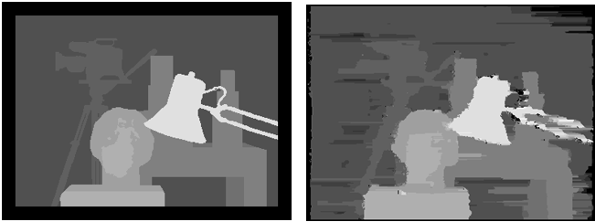

# computer vision

## image stitch
- [cv2 stitching_detailed.py](https://github.com/opencv/opencv/blob/master/samples/python/stitching_detailed.py)
- feature, seam finder 수행 후 webcam 이미지 순차적으로 stitch

## stereo matching
- dynamic programming 사용
- matching cost: ssd, ncc, color+gradient
- left-right consistency check

